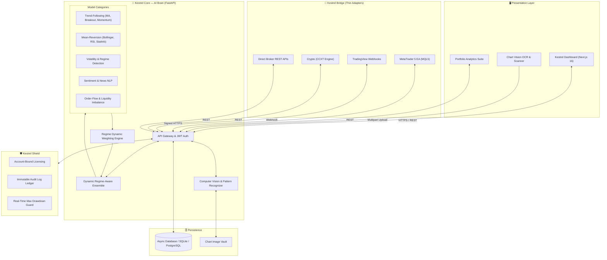

<p align="center">
  
</p>

<h1 align="center">🦅 K E S T R E L</h1>

<p align="center">
  <strong>Cross-Platform AI Trading Intelligence & Ensemble Decision Engine</strong><br>
  <em>"See every market. Miss nothing."</em>
</p>

<p align="center">
  <a href="https://github.com/MacJezzl1/kestrel"></a>
  <a href="https://github.com/MacJezzl1/kestrel"></a>
  <a href="https://github.com/MacJezzl1/kestrel"></a>
  <a href="https://github.com/MacJezzl1/kestrel"></a>
  <a href="https://github.com/MacJezzl1/kestrel"></a>
  <a href="https://github.com/MacJezzl1/kestrel"></a>
</p>

---

## ⚡ Executive Summary

**Kestrel** is a next-generation AI trading intelligence platform developed by **CapeChain Labs**. Designed as an independent cloud-native "Brain", Kestrel decouples deep quantitative analysis and multi-model ensemble intelligence from individual brokers or execution terminals. 

Unlike black-box Expert Advisors (EAs) or hype-driven bots, Kestrel provides:
* **Verifiable Audit Trails**: Immutable logs for every model vote, confidence score, and executed trade.
* **Regime-Aware Dynamic Ensembles**: Active weighting across trend-following, mean-reversion, volatility, sentiment, and order-flow models.
* **Kestrel Vision**: Computer-vision chart scanning allowing traders to snap or upload screenshots of any chart for instant pattern recognition and trade setups.
* **Thin-Bridge Architecture**: Swappable adapters for MT4/MT5, TradingView, and direct crypto/broker APIs.
* **Kestrel Shield**: Account-bound, cryptographic server-side licensing with automated drawdown guards.

---

## 🏛️ System Architecture



---

## 💎 Product Family

| Module | Purpose | Status |
| :--- | :--- | :---: |
| **🦅 Kestrel Core** | High-throughput FastAPI engine running 100-AI swarm ensemble with dynamic recovery matrix |  |
| **🧠 100-AI Swarm** | 5 specialized swarms (Macro, Price Action, Quant Arbitrage, Momentum, Sentiment) aggregating 100 models |  |
| **🗄️ Supabase Cloud DB** | Real-time PostgreSQL database with live WebSockets, RLS, trade ledger, and license management |  |
| **👁️ Kestrel Vision** | Chart screenshot & camera scanning module extracting S/R levels, patterns, and trendlines |  |
| **🔌 Kestrel Bridge (MT5)** | Next-gen MQL5 EA with cyber on-chart HUD, live PnL, recovery level, and 100% autonomous auto-pilot |  |
| **🛡️ Kestrel Shield** | Server-side JWT authentication, rate limiting, and immutable audit logs |  |
| **📊 Kestrel Dashboard** | Ultra-modern dark navy / steel-blue interface with deep performance analytics |  |

---

## 🧠 100-AI Swarm Intelligence Architecture

Kestrel v2.0 introduces the **100-Model Swarm Engine** dividing 100 specialized algorithmic, quantitative, and AI reasoning agents across 5 distinct intelligence swarms (20 models each):

1. **🌐 Macro & Geopolitical Swarm (20 Models)**: DXY momentum, yield curve inversion, Fed funds delta, CPI inflation surprises, commodity correlations, COT net positioning, cross-currency basis, and sovereign risk indices.
2. **🕯️ Price Action & Microstructure Swarm (20 Models)**: Multi-timeframe Order Blocks, Fair Value Gaps (FVG), Liquidity Grabs (Highs/Lows), Market Structure Shifts (MSS), Wyckoff accumulation/distribution phases, and session opening sweeps.
3. **📐 Statistical Arbitrage & Quant Swarm (20 Models)**: Kalman Filter price estimation, Hurst Exponent fractal persistence, Ornstein-Uhlenbeck mean-reversion, GARCH volatility clustering, Shannon entropy disorder, and Monte Carlo path projections.
4. **🌊 Momentum & Wave Swarm (20 Models)**: Adaptive EMA ribbons, Ichimoku cloud dynamic, SuperTrend multi-TF, Hull moving average slope, Chaikin Money Flow (CMF), and vortex trend energy.
5. **🤖 Sentiment, NLP & AI Reasoning Swarm (20 Models)**: News sentiment NLP, Central Bank tone analysis, orderbook bid/ask depth imbalance, institutional dark pool tracking, and reasoning consensus arbiters.

---

## 🗄️ Supabase Cloud Database Integration

Kestrel connects directly to [Supabase PostgreSQL](https://supabase.com/dashboard/org/qbdmnpjvkllktwkoqeow) for cloud storage, audit trails, and multi-client real-time synchronization:

* **DDL Schema**: Located in [`backend/db/supabase_schema.sql`](./backend/db/supabase_schema.sql)
* **Tables Included**:
  * `accounts`: Live equity, balance, drawdown, and recovery levels.
  * `trades`: Complete audit trail of entries, exits, profit/loss, pips, and MT5 tickets.
  * `signals`: 100-AI consensus breakdown, confidence, and market regime classifications.
  * `ai_models`: Model registry with dynamic accuracy weights and latency metrics.
  * `performance_snapshots`: Historical equity curves and daily PnL stats.
  * `system_logs`: Real-time operational logs.

### Setting up Supabase:
1. Open your project on [Supabase Dashboard](https://supabase.com/dashboard/org/qbdmnpjvkllktwkoqeow).
2. Go to **SQL Editor** → Paste and run [`backend/db/supabase_schema.sql`](./backend/db/supabase_schema.sql).
3. Set your credentials in `backend/.env`:
   ```env
   SUPABASE_URL="https://qbdmnpjvkllktwkoqeow.supabase.co"
   SUPABASE_KEY="your-anon-or-service-role-key"
   ```

---

## 🚀 Quick Start Guide

### Prerequisites
* **Python 3.11+**
* **Node.js 18+** & **npm**
* (Optional) **MetaTrader 5 Terminal** for live trade execution

---

### 1️⃣ Start Backend (Kestrel Core API)

```bash
# Navigate to backend
cd backend

# Install dependencies
pip install -r requirements.txt

# Launch FastAPI service
python -m uvicorn app.main:app --reload --port 8000
```
> 🌐 **Backend API:** `http://localhost:8000`  
> 📖 **Interactive Swagger Docs:** `http://localhost:8000/docs`

---

### 2️⃣ Start Frontend (Kestrel Dashboard)

```bash
# Navigate to frontend
cd frontend

# Install dependencies
npm install

# Launch Next.js dev server
npm run dev
```
> 💻 **Dashboard Portal:** `http://localhost:3000`

---

### 3️⃣ Setup MetaTrader 5 Bridge Adapter (Autonomous Mode)

1. Open **MetaTrader 5** → Navigate to `File` → `Open Data Folder` → `MQL5` → `Experts`.
2. Copy [`adapters/mt5/KestrelEA.mq5`](./adapters/mt5/KestrelEA.mq5) into the `Experts` directory.
3. In MT5, go to `Tools` → `Options` → `Expert Advisors`:
   * Check **"Allow WebRequest for listed URL"**
   * Add your API endpoints: `http://localhost:8000` and `https://qbdmnpjvkllktwkoqeow.supabase.co`.
4. Compile `KestrelEA.mq5` in MetaEditor and attach it to your chart!
   * The manual Buy/Sell one-click bar is hidden automatically for pure **100% Autonomous Auto-Pilot**.
   * The futuristic cyber HUD will display live PnL, Recovery Multiplier, and 100-AI consensus votes directly on your chart canvas.

---

## 📂 Repository Layout

```text
Kestrel/
├── assets/                          # Brand graphics & visual logo
│   └── kestrel_logo.jpg
├── backend/                         # Kestrel Core (Python FastAPI)
│   ├── app/
│   │   ├── main.py                  # API entry point & CORS
│   │   ├── core/                    # Security, JWT, config & constants
│   │   ├── models/                  # SQLAlchemy ORM schemas
│   │   ├── schemas/                 # Pydantic request/response models
│   │   ├── routers/                 # Auth, Signals, Trades, Dashboard, Vision
│   │   ├── services/
│   │   │   ├── ensemble/            # 100-AI Swarm & regime-aware weights
│   │   │   ├── shield/              # Licensing & immutable audit logging
│   │   │   └── vision/              # Chart digitization pipeline
│   │   └── db/                      # Supabase & SQLite persistence
│   ├── db/
│   │   └── supabase_schema.sql      # Supabase PostgreSQL DDL migration
│   ├── pyproject.toml
│   └── requirements.txt
├── frontend/                        # Kestrel Dashboard (Next.js 16 + TS)
│   ├── src/
│   │   ├── app/                     # Next.js App Router (Dashboard, Vision, Signals, Trades)
│   │   ├── components/layout/       # Sidebar & navigation
│   │   └── lib/                     # API client & auth context
│   ├── package.json
│   └── tsconfig.json
├── adapters/                        # Bridge Thin Clients
│   └── mt5/
│       └── KestrelEA.mq5            # Expert Advisor with on-chart Cyber HUD
└── README.md                        # Master Project Documentation
```

---

## 🛡️ Risk & Compliance Disclaimer

> **IMPORTANT NOTICE:**  
> Trading in financial markets (Forex, Equities, Commodities, and Cryptocurrencies) carries a substantial risk of loss and is not suitable for all investors. Kestrel is an AI-assisted decision support and automated execution infrastructure designed by CapeChain Labs. It does not provide guaranteed returns. Past performance and simulated backtesting do not guarantee future results. Users retain full responsibility for their capital allocation and risk settings.

---

<p align="center">
  <strong>CapeChain Labs</strong> • <em>See every market. Miss nothing.</em>
</p>
