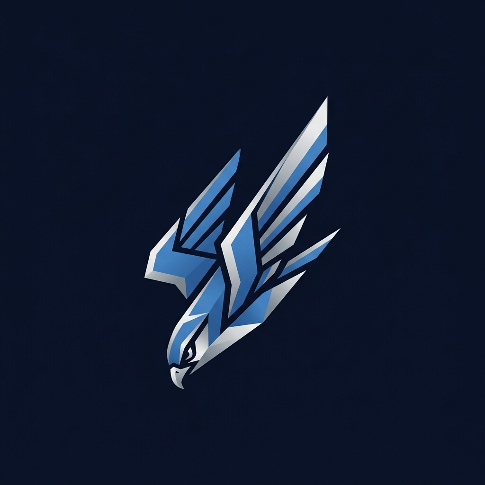
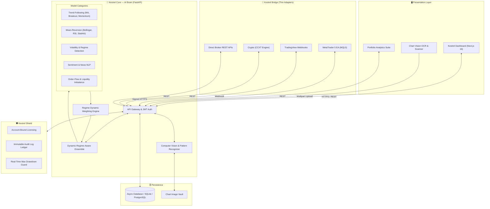

<p align="center">
  
</p>

<h1 align="center">🦅 K E S T R E L</h1>

<p align="center">
  <strong>Cross-Platform AI Trading Intelligence & Ensemble Decision Engine</strong><br>
  <em>"See every market. Miss nothing."</em>
</p>

<p align="center">
  <a href="https://github.com/MacJezzl1/kestrel"></a>
  <a href="https://github.com/MacJezzl1/kestrel"></a>
  <a href="https://github.com/MacJezzl1/kestrel"></a>
  <a href="https://github.com/MacJezzl1/kestrel"></a>
  <a href="https://github.com/MacJezzl1/kestrel"></a>
  <a href="https://github.com/MacJezzl1/kestrel"></a>
</p>

---

## ⚡ Executive Summary

**Kestrel** is a next-generation AI trading intelligence platform developed by **CapeChain Labs**. Designed as an independent cloud-native "Brain", Kestrel decouples deep quantitative analysis and multi-model ensemble intelligence from individual brokers or execution terminals. 

Unlike black-box Expert Advisors (EAs) or hype-driven bots, Kestrel provides:
* **Verifiable Audit Trails**: Immutable logs for every model vote, confidence score, and executed trade.
* **Regime-Aware Dynamic Ensembles**: Active weighting across trend-following, mean-reversion, volatility, sentiment, and order-flow models.
* **Kestrel Vision**: Computer-vision chart scanning allowing traders to snap or upload screenshots of any chart for instant pattern recognition and trade setups.
* **Thin-Bridge Architecture**: Swappable adapters for MT4/MT5, TradingView, and direct crypto/broker APIs.
* **Kestrel Shield**: Account-bound, cryptographic server-side licensing with automated drawdown guards.

---

## 🏛️ System Architecture



---

## 💎 Product Family

| Module | Purpose | Status |
| :--- | :--- | :---: |
| **🦅 Kestrel Core** | High-throughput FastAPI engine running regime-aware multi-model ensembles |  |
| **👁️ Kestrel Vision** | Chart screenshot & camera scanning module extracting S/R levels, patterns, and trendlines |  |
| **🔌 Kestrel Bridge** | Swappable thin clients (MT5 EA included) reporting execution & receiving signals |  |
| **🛡️ Kestrel Shield** | Server-side JWT authentication, rate limiting, and immutable audit logs |  |
| **📊 Kestrel Dashboard** | Ultra-modern dark navy / steel-blue interface with deep performance analytics |  |

---

## 🥊 Competitive Differentiation

| Capability | Legacy / Competitor EAs | Kestrel Platform |
| :--- | :--- | :--- |
| **Architecture** | Heavy DLLs or locked single-terminal bots | Independent cloud brain + ultra-thin client adapters |
| **Model Intelligence** | Single indicator or opaque black-box formula | Dynamic ~60-100 model ensemble across 5-9 distinct categories |
| **Decision Transparency** | Zero visibility into reasons | Full audit trail displaying which models agreed/disagreed |
| **Visual Analysis** | None | **Kestrel Vision** chart upload & pattern scanner |
| **Risk Protection** | Fixed stop-loss or martingale risk | Active Max Drawdown Guard with live risk budgeting |
| **Cross-Platform** | Terminal-locked (MT4 only or MT5 only) | Cross-platform (MT5, Web, TradingView, Crypto ready) |
| **Licensing** | Static strings easily leaked or decompiled | Account-bound cryptographically signed JWT sessions |

---

## 🚀 Quick Start Guide

### Prerequisites
* **Python 3.11+**
* **Node.js 18+** & **npm**
* (Optional) **MetaTrader 5 Terminal** for live trade execution

---

### 1️⃣ Start Backend (Kestrel Core API)

```bash
# Navigate to backend
cd backend

# Install dependencies
pip install -r requirements.txt

# Launch FastAPI service
python -m uvicorn app.main:app --reload --port 8000
```
> 🌐 **Backend API:** `http://localhost:8000`  
> 📖 **Interactive Swagger Docs:** `http://localhost:8000/docs`

---

### 2️⃣ Start Frontend (Kestrel Dashboard)

```bash
# Navigate to frontend
cd frontend

# Install dependencies
npm install

# Launch Next.js dev server
npm run dev
```
> 💻 **Dashboard Portal:** `http://localhost:3000`

---

### 3️⃣ Setup MetaTrader 5 Bridge Adapter

1. Open **MetaTrader 5** → Navigate to `File` → `Open Data Folder` → `MQL5` → `Experts`.
2. Copy [`adapters/mt5/KestrelEA.mq5`](./adapters/mt5/KestrelEA.mq5) into the `Experts` directory.
3. In MT5, go to `Tools` → `Options` → `Expert Advisors`:
   * Check **"Allow WebRequest for listed URL"**
   * Add your API endpoint: `http://localhost:8000` (or your cloud production URL).
4. Compile `KestrelEA.mq5` in MetaEditor and attach it to any chart!

---

## 📂 Repository Layout

```text
Kestrel/
├── assets/                          # Brand graphics & visual logo
│   └── kestrel_logo.jpg
├── backend/                         # Kestrel Core (Python FastAPI)
│   ├── app/
│   │   ├── main.py                  # API entry point & CORS
│   │   ├── core/                    # Security, JWT, config & constants
│   │   ├── models/                  # SQLAlchemy ORM schemas
│   │   ├── schemas/                 # Pydantic request/response models
│   │   ├── routers/                 # Auth, Signals, Trades, Dashboard, Vision
│   │   ├── services/
│   │   │   ├── ensemble/            # Model categories & regime-aware weights
│   │   │   ├── shield/              # Licensing & immutable audit logging
│   │   │   └── vision/              # Chart digitization pipeline
│   │   └── db/                      # Async database engine
│   ├── pyproject.toml
│   └── requirements.txt
├── frontend/                        # Kestrel Dashboard (Next.js 16 + TS)
│   ├── src/
│   │   ├── app/
│   │   │   ├── page.tsx             # Auth & registration portal
│   │   │   ├── dashboard/           # Live metrics, status & drawdown guard
│   │   │   ├── signals/             # On-demand AI signal generator
│   │   │   ├── trades/              # Comprehensive trade history & stats
│   │   │   ├── analysis/            # Portfolio ratios & performance matrices
│   │   │   ├── vision/              # Chart upload & OCR analysis
│   │   │   ├── settings/            # License tier & bridge preferences
│   │   │   └── globals.css          # Design system
│   │   ├── components/layout/       # Sidebar & navigation
│   │   └── lib/                     # API client & auth context
│   ├── package.json
│   └── tsconfig.json
├── adapters/                        # Bridge Thin Clients
│   └── mt5/
│       └── KestrelEA.mq5            # Expert Advisor (MQL5)
└── README.md                        # Master Project Documentation
```

---

## 🛡️ Risk & Compliance Disclaimer

> **IMPORTANT NOTICE:**  
> Trading in financial markets (Forex, Equities, Commodities, and Cryptocurrencies) carries a substantial risk of loss and is not suitable for all investors. Kestrel is an AI-assisted decision support and automated execution infrastructure designed by CapeChain Labs. It does not provide guaranteed returns. Past performance and simulated backtesting do not guarantee future results. Users retain full responsibility for their capital allocation and risk settings.

---

<p align="center">
  <strong>CapeChain Labs</strong> • <em>See every market. Miss nothing.</em>
</p>
